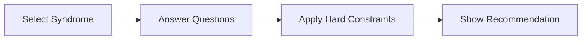
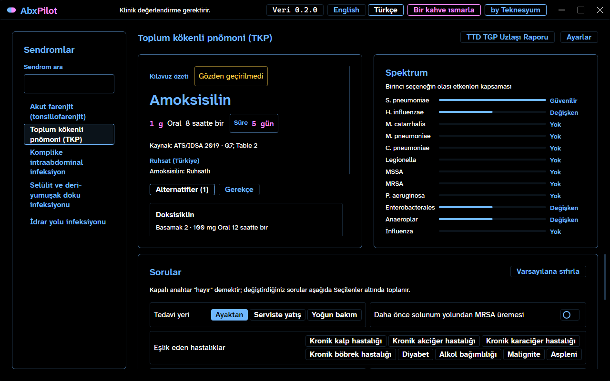
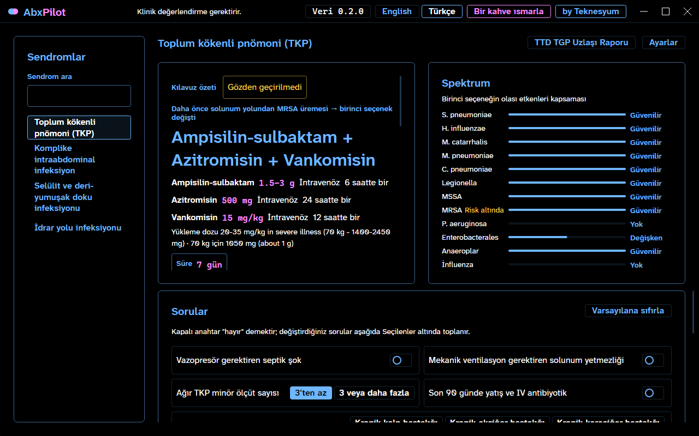
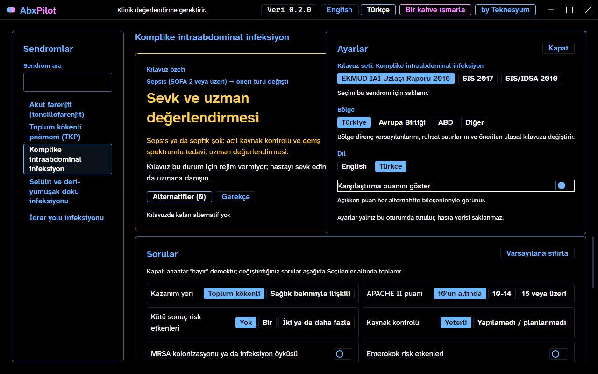

<!-- lang -->

[](README.tr.md)


# AbxPilot

Empiric antibiotic guideline navigator.

## What it is

AbxPilot helps a clinician find what the current guideline says about empiric antibiotic
choice for a syndrome. You pick a syndrome, answer a few questions, and the program shows the
guideline's first choice, alternatives, dose, route and duration, with the source section.

It is a guideline navigator and an educational tool. It is not a medical device and it does
not write prescriptions. Every result needs clinical judgement. The baseline patient is a
healthy 70 kg adult.

## "Doesn't the guideline already do this?"

It does: the guideline is the source and AbxPilot adds no medical knowledge of its own.
What it adds:

- The decision path is walked for you, one question at a time, instead of across pages.
- Every line carries its source, section, source date and review date.
- Hard constraints (allergy, pregnancy, renal function) remove regimens and say why.
- Turkish first, English next, same data behind both.

## Features

- **Guideline summary card**: regimen, dose, route and duration in one place.
- **Spectrum strip**: what the chosen regimen covers, drawn from the same record.
- **Question panel**: only the questions that change the answer.
- **Knowledge base as data**: records live in `kb/`, never in code.
- **Custom title bar**: drag, double-click to maximize, Aero Snap and Alt+F4 work.

## What it does not do

- It does not diagnose.
- It does not score or rank with a model; there is no LLM and no machine learning.
- It does not replace local antibiograms or infectious disease consultation.
- It does not dose for children or pregnancy beyond what the guideline states. Renal doses come only from the product label (US FDA, or EU/UK SmPC); where the label gives none, it says so.

## Installation

**Recommended: Teknesyum Base (Windows).**

1. Download [`Teknesyum-Base.exe`](https://github.com/Teknesyum/Teknesyum-Base/releases/latest/download/Teknesyum-Base.exe) ([`.sha256`](https://github.com/Teknesyum/Teknesyum-Base/releases/latest/download/Teknesyum-Base.exe.sha256)) and run it. No admin rights are needed.
2. Find **AbxPilot** in the list and install it. Base also updates and removes it later.

Base is not code-signed yet, so Windows SmartScreen may warn on first launch: choose *More info*, then *Run anyway*. More: [Teknesyum Base](https://github.com/Teknesyum/Teknesyum-Base).

**Or install manually.**

Windows (x64, no admin rights, no .NET SDK or Git needed): download `Kur.bat` and
`kur-abxpilot.ps1` from the [latest release](https://github.com/Teknesyum/AbxPilot/releases)
into one folder and run `Kur.bat`. If Windows blocks the script, run
`Unblock-File kur-abxpilot.ps1` once.

The installer fetches the release zip and its `.sha256` file from GitHub over HTTPS,
checks the hash and stops without touching anything on a mismatch. It installs to
`%LOCALAPPDATA%\Programs\AbxPilot` and writes a desktop shortcut.

```
Kur.bat -Surum v0.1.0-onizleme   pin a release instead of the latest
Kur.bat -Prova                   dry run into a temp folder, no shortcut
Kur.bat -Onar                    reinstall; local data is backed up and restored
```

Without a connection it uses a zip plus `.sha256` placed next to `Kur.bat` (USB stick).
Preview releases are not for clinical use.

Checking a download by hand, in PowerShell:

```
(Get-FileHash .\AbxPilot-win-x64-v0.1.0-onizleme.zip -Algorithm SHA256).Hash
Get-Content .\AbxPilot-win-x64-v0.1.0-onizleme.zip.sha256
```

The two hashes must match (case does not matter).

**From source.** Get the code with `git clone https://github.com/Teknesyum/AbxPilot.git`
(or *Code → Download ZIP* on GitHub). Then, in the repository folder:

1. Install the .NET 10 SDK once: `winget install Microsoft.DotNet.SDK.10` (or from
   [dot.net](https://dot.net)). `global.json` picks the right version.
2. Run it straight away:

   ```
   dotnet run --project src/AbxPilot.Desktop
   ```

3. Or install it like a release, with Start menu and desktop shortcuts, under
   `%LOCALAPPDATA%\Programs\AbxPilot` (no admin rights):

   ```
   powershell -ExecutionPolicy Bypass -File tools/publish-desktop.ps1
   ```

   Run the same line again after `git pull` to update.

## How it works

The engine is a guideline decision table plus hard constraints. The knowledge base is JSON in
`kb/`, embedded into `AbxPilot.Data` at build time. The UI reads it through `AbxPilot.Core`
interfaces and never holds medical content itself.



Selecting a syndrome loads its guideline table; each answered question narrows the table;
hard constraints remove regimens and state why; the remaining first choice and alternatives
are shown with source, dose, route and duration.

## The program shows it works



Main window: syndrome rail, guideline summary card, spectrum strip, question panel and the
permanent disclaimer strip.



Recommendation card: first choice with dose, route and duration, its source section, and the
alternatives ranked below it.



Settings panel: guideline set, region and the score-hint toggle.

## Development

```
dotnet build AbxPilot.sln -c Debug
```

```
dotnet test AbxPilot.sln
```

| Path | Role |
|---|---|
| `src/AbxPilot.Core` | Engine contracts and records |
| `src/AbxPilot.Data` | Embedded knowledge base and strings |
| `src/AbxPilot.UI` | Avalonia views, view models, theme, title bar |
| `src/AbxPilot.Desktop` | Windows executable |
| `src/AbxPilot.Android` | Android head, built only from `AbxPilot.Android.sln` |
| `tools/AbxPilot.KbCompiler` | Knowledge base compiler |
| `tests/AbxPilot.Tests` | xunit tests, including the shell standard |

## Contributing

Open an issue first, then send a small pull request. The repository language is English.
Contributions are accepted under the project license. There is no CLA and no DCO.
If the project helps you, sponsoring keeps it going.

## License

AGPL-3.0-or-later. See [LICENSE](LICENSE).

<!-- signature -->
<div align="center">

<a href="https://github.com/sponsors/Teknesyum"></a>
&nbsp;
<a href="LICENSE"></a>

</div>
