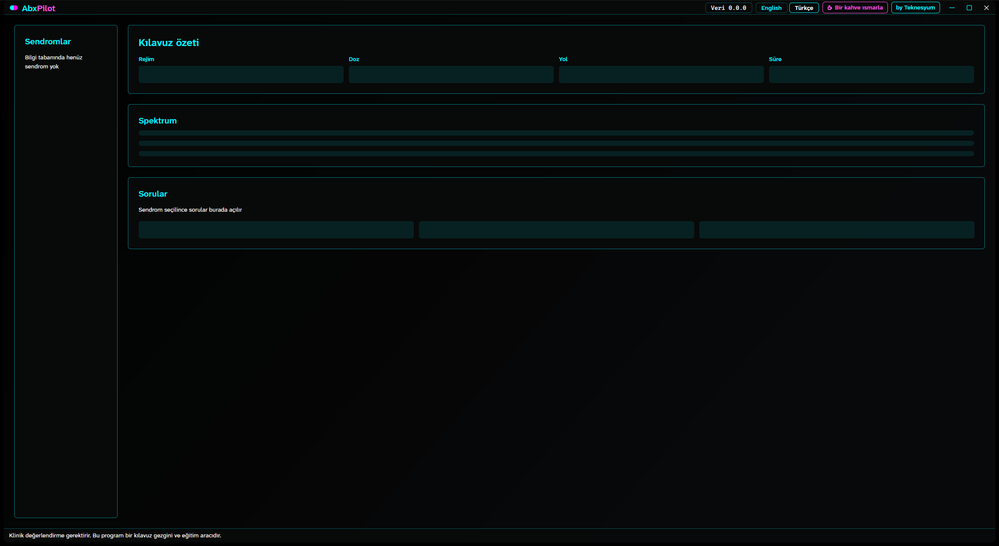

<!-- lang -->

[](README.md)

# AbxPilot

Ampirik antibiyotik kılavuz gezgini.

## Nedir

AbxPilot, bir sendromda ampirik antibiyotik seçimi için güncel kılavuzun ne dediğini bulmaya
yardım eder. Sendromu seçersiniz, birkaç soruyu yanıtlarsınız; program kılavuzun ilk
seçeneğini, alternatiflerini, dozu, yolu ve süreyi kaynak bölümüyle birlikte gösterir.

Bir kılavuz gezgini ve eğitim aracıdır. Tıbbi cihaz değildir, reçete yazmaz. Her sonuç
klinik değerlendirme gerektirir. Temel hasta sağlıklı, 70 kg bir erişkindir.

## "Bunu kılavuz zaten yapmıyor mu?"

Yapıyor: kaynak kılavuzdur, AbxPilot kendi tıbbi bilgisini eklemez. Eklediği şunlar:

- Karar yolu sayfalar arasında değil, soru soru sizin yerinize yürünür.
- Her satır kaynağını, bölümünü, kaynak tarihini ve gözden geçirme tarihini taşır.
- Katı kısıtlar (alerji, gebelik, böbrek işlevi) rejimi çıkarır ve nedenini söyler.
- Önce Türkçe, sonra İngilizce; ikisinin arkasında aynı veri.

## Özellikler

- **Kılavuz özeti kartı**: rejim, doz, yol ve süre tek yerde.
- **Spektrum şeridi**: seçilen rejimin neyi kapsadığı, aynı kayıttan çizilir.
- **Soru paneli**: yalnız cevabı değiştiren sorular.
- **Veri olarak bilgi tabanı**: kayıtlar `kb/` içinde durur, kodda asla.
- **Kendi başlık çubuğu**: sürükleme, çift tıkla büyütme, Aero Snap ve Alt+F4 çalışır.

## Yapmadıkları

- Tanı koymaz.
- Bir modelle puanlamaz ya da sıralamaz; LLM ve makine öğrenmesi yoktur.
- Yerel antibiyogramın ya da enfeksiyon hastalıkları konsültasyonunun yerini tutmaz.
- Çocuk, gebelik ya da böbrek yetmezliği dozunu kılavuzun söylediğinin ötesinde vermez.

## Kurulum

Program A0 aşamasında: kabuk çalışır, bilgi tabanı boştur.

Windows, kurucuyla hazırlanmış USB bellekten:

```
Kur.bat
```

Kaynaktan, .NET 9 SDK ile:

```
dotnet run --project src/AbxPilot.Desktop
```

## Nasıl çalışır

Motor, bir kılavuz karar tablosu ile katı kısıtlardan oluşur. Bilgi tabanı `kb/` içindeki
JSON'dur ve derlemede `AbxPilot.Data` içine gömülür. Arayüz onu `AbxPilot.Core`
arayüzleri üzerinden okur; tıbbi içeriği kendisi tutmaz.

## Program ne yaptığını gösterir



A0 aşamasında ana pencere: sendrom listesi, kılavuz özeti kartı, spektrum şeridi, soru paneli
ve kalıcı uyarı şeridi.

## Geliştirme

```
dotnet build AbxPilot.sln -c Debug
```

```
dotnet test AbxPilot.sln
```

| Yol | Görev |
|---|---|
| `src/AbxPilot.Core` | Motor sözleşmeleri ve kayıtlar |
| `src/AbxPilot.Data` | Gömülü bilgi tabanı ve metinler |
| `src/AbxPilot.UI` | Avalonia görünümleri, görünüm modelleri, tema, başlık çubuğu |
| `src/AbxPilot.Desktop` | Windows çalıştırılabilir dosyası |
| `src/AbxPilot.Android` | Android başı, yalnız `AbxPilot.Android.sln` ile derlenir |
| `tools/AbxPilot.KbCompiler` | Bilgi tabanı derleyicisi |
| `tests/AbxPilot.Tests` | Kabuk standardı dahil xunit testleri |

## Katkı

Önce bir issue açın, sonra küçük bir pull request gönderin. Depo dili İngilizcedir.
Katkılar proje lisansı altında kabul edilir. CLA ve DCO yoktur.
Proje işinize yarıyorsa sponsorluk onu sürdürür.

## Lisans

[AGPL-3.0-or-later](LICENSE)

<!-- signature -->
<div align="center">

<a href="https://github.com/sponsors/Teknesyum"></a>
&nbsp;
<a href="LICENSE"></a>

</div>
