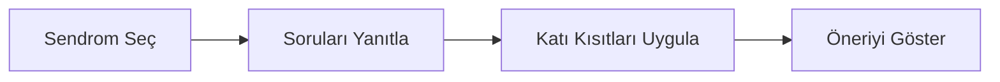

<!-- lang -->

[](README.md)


# AbxPilot

Ampirik antibiyotik kılavuz gezgini.

## Nedir

AbxPilot, bir sendromda ampirik antibiyotik seçimi için güncel kılavuzun ne dediğini bulmaya
yardım eder. Sendromu seçersiniz, birkaç soruyu yanıtlarsınız; program kılavuzun ilk
seçeneğini, alternatiflerini, dozu, yolu ve süreyi kaynak bölümüyle birlikte gösterir.

Bir kılavuz gezgini ve eğitim aracıdır. Tıbbi cihaz değildir, reçete yazmaz. Her sonuç
klinik değerlendirme gerektirir. Temel hasta sağlıklı, 70 kg bir erişkindir.

## "Bunu kılavuz zaten yapmıyor mu?"

Yapıyor: kaynak kılavuzdur, AbxPilot kendi tıbbi bilgisini eklemez. Eklediği şunlar:

- Karar yolu sayfalar arasında değil, soru soru sizin yerinize yürünür.
- Her satır kaynağını, bölümünü, kaynak tarihini ve gözden geçirme tarihini taşır.
- Katı kısıtlar (alerji, gebelik, böbrek işlevi) rejimi çıkarır ve nedenini söyler.
- Önce Türkçe, sonra İngilizce; ikisinin arkasında aynı veri.

## Özellikler

- **Kılavuz özeti kartı**: rejim, doz, yol ve süre tek yerde.
- **Spektrum şeridi**: seçilen rejimin neyi kapsadığı, aynı kayıttan çizilir.
- **Soru paneli**: yalnız cevabı değiştiren sorular.
- **Veri olarak bilgi tabanı**: kayıtlar `kb/` içinde durur, kodda asla.
- **Kendi başlık çubuğu**: sürükleme, çift tıkla büyütme, Aero Snap ve Alt+F4 çalışır.

## Yapmadıkları

- Tanı koymaz.
- Bir modelle puanlamaz ya da sıralamaz; LLM ve makine öğrenmesi yoktur.
- Yerel antibiyogramın ya da enfeksiyon hastalıkları konsültasyonunun yerini tutmaz.
- Çocuk, gebelik ya da böbrek yetmezliği dozunu kılavuzun söylediğinin ötesinde vermez.

## Kurulum

**Önerilen: Teknesyum Base (Windows).**

1. [`Teknesyum-Base.exe`](https://github.com/Teknesyum/Teknesyum-Base/releases/latest/download/Teknesyum-Base.exe) dosyasını ([`.sha256`](https://github.com/Teknesyum/Teknesyum-Base/releases/latest/download/Teknesyum-Base.exe.sha256)) indirip çalıştırın. Yönetici hakkı gerekmez.
2. Listeden **AbxPilot** uygulamasını bulup kurun. Base sonradan güncellemeyi ve kaldırmayı da yapar.

Base henüz imzalı değil; Windows SmartScreen ilk açılışta uyarabilir: *Diğer bilgiler*'i, sonra *Yine de çalıştır*'ı seçin. Ayrıntı: [Teknesyum Base](https://github.com/Teknesyum/Teknesyum-Base).

**Ya da elle kurun.**

Program A0 aşamasında: kabuk çalışır, bilgi tabanı boştur.

Windows (x64, yönetici yetkisi, .NET SDK ya da Git gerekmez): `Kur.bat` ile
`kur-abxpilot.ps1` dosyalarını [son sürümden](https://github.com/Teknesyum/AbxPilot/releases)
aynı klasöre indirin, `Kur.bat`'ı çalıştırın. Windows betiği engellerse bir kez
`Unblock-File kur-abxpilot.ps1` çalıştırın.

Kurucu sürüm zip'ini ve `.sha256` dosyasını GitHub'dan HTTPS ile indirir, özeti denetler;
uyuşmazsa hiçbir şeye dokunmadan durur. `%LOCALAPPDATA%\Programs\AbxPilot` altına kurar,
masaüstüne kısayol yazar.

```
Kur.bat -Surum v0.1.0-onizleme   son sürüm yerine belirli bir sürüm
Kur.bat -Prova                   geçici klasöre deneme kurulumu, kısayol yok
Kur.bat -Onar                    baştan kurulum; yerel veri yedeklenip geri yüklenir
```

Bağlantı yoksa `Kur.bat`'ın yanına konmuş zip ile `.sha256` dosyasını kullanır (USB bellek).
Önizleme sürümleri klinik kullanım için değildir.

İndirilen dosyayı elle denetlemek için PowerShell'de:

```
(Get-FileHash .\AbxPilot-win-x64-v0.1.0-onizleme.zip -Algorithm SHA256).Hash
Get-Content .\AbxPilot-win-x64-v0.1.0-onizleme.zip.sha256
```

İki özet aynı olmalı (büyük/küçük harf fark etmez).

Kaynaktan, .NET 10 SDK ile:

```
dotnet run --project src/AbxPilot.Desktop
```

## Nasıl çalışır

Motor, bir kılavuz karar tablosu ile katı kısıtlardan oluşur. Bilgi tabanı `kb/` içindeki
JSON'dur ve derlemede `AbxPilot.Data` içine gömülür. Arayüz onu `AbxPilot.Core`
arayüzleri üzerinden okur; tıbbi içeriği kendisi tutmaz.



Sendrom seçimi ilgili kılavuz tablosunu yükler; her yanıtlanan soru tabloyu daraltır; katı
kısıtlar rejimleri çıkarır ve nedenini söyler; kalan birinci seçenek ve alternatifler kaynak,
doz, yol ve süreyle gösterilir.

## Program ne yaptığını gösterir


Ana pencere: sendrom listesi, kılavuz özeti kartı, spektrum şeridi, soru paneli ve kalıcı
uyarı şeridi.


Öneri kartı: doz, yol ve süresiyle birinci seçenek, kaynak bölümü ve altındaki sıralı
alternatifler.


Ayarlar paneli: kılavuz seti, bölge ve puan-ipucu anahtarı.

## Geliştirme

```
dotnet build AbxPilot.sln -c Debug
```

```
dotnet test AbxPilot.sln
```

| Yol | Görev |
|---|---|
| `src/AbxPilot.Core` | Motor sözleşmeleri ve kayıtlar |
| `src/AbxPilot.Data` | Gömülü bilgi tabanı ve metinler |
| `src/AbxPilot.UI` | Avalonia görünümleri, görünüm modelleri, tema, başlık çubuğu |
| `src/AbxPilot.Desktop` | Windows çalıştırılabilir dosyası |
| `src/AbxPilot.Android` | Android başı, yalnız `AbxPilot.Android.sln` ile derlenir |
| `tools/AbxPilot.KbCompiler` | Bilgi tabanı derleyicisi |
| `tests/AbxPilot.Tests` | Kabuk standardı dahil xunit testleri |

## Katkı

Önce bir issue açın, sonra küçük bir pull request gönderin. Depo dili İngilizcedir.
Katkılar proje lisansı altında kabul edilir. CLA ve DCO yoktur.
Proje işinize yarıyorsa sponsorluk onu sürdürür.

## Lisans

AGPL-3.0-or-later. Bkz. [LICENSE](LICENSE).

<!-- signature -->
<div align="center">

<a href="https://github.com/sponsors/Teknesyum"></a>
&nbsp;
<a href="LICENSE"></a>

</div>
